# CueBee Inference Infrastructure

CueBee is a real-time inference control plane for long-lived audio conversations. It combines:

- multi-tenant speaker embedding serving with Voice Activity Detection (VAD), length buckets, cross-session micro-batching, stable speaker identities, and an audio-load autoscaler;
- a stateful Large Language Model (LLM) runtime for revisable Speech-to-Text (STT) input, with a committed conversation spine, tentative tail rollback, Copy-on-Write (COW) branches, semantic scheduling, and a final freshness gate.

This repository implements the system semantics around vLLM. It does not rebrand upstream PagedAttention, continuous batching, or Automatic Prefix Caching (APC) as CueBee features.

## Current status

| Area | Implemented now | Hardware validation still required |
|---|---|---|
| Transcript runtime | Idempotent events, token-level diff, stable/tentative state, configurable tokenizer guard | Replay production STT traces after redaction |
| Key-Value (KV) lifecycle | Logical references, branch invalidation, physical suffix rollback, and batched partial-block COW in the pinned vLLM fork | Compile and benchmark the Compute Unified Device Architecture (CUDA) kernel on NVIDIA L4; validate additional cache layouts |
| Scheduling | Version, deadline, foreground, age, prefix reuse, cost, overload shedding | Tune weights on NVIDIA L4 traces |
| Output safety | Abort propagation plus freshness gate | Inject abort/output races under vLLM load |
| Speaker serving | VAD, deadline-aware micro-batching, stable Session Store, worker replacement, autoscaler | Replace deterministic worker with the frozen Open Neural Network Exchange (ONNX) model and collect latency |
| Interfaces | JavaScript Object Notation (JSON) over Hypertext Transfer Protocol (HTTP), metrics, demos, trace replay, container | Add production authentication, Transport Layer Security (TLS), and durable state |

No throughput or latency claim in this repository should be treated as an L4 result until the benchmark metadata and raw request records are checked in.

## Quick start

Requires Python 3.11 or newer and has no mandatory third-party runtime dependency.

```bash
make test
make demo
make benchmark-stt
make benchmark-speaker
make serve
```

If the default `python3` is older, pass a newer interpreter explicitly:

```bash
make test PYTHON=/path/to/python3
```

The server listens on `127.0.0.1:8080` by default. A minimal transcript flow is:

```bash
curl -s http://127.0.0.1:8080/v1/sessions/demo/stt \
  -H 'content-type: application/json' \
  -d '{"segment_id":"seg-1","revision":1,"type":"append_partial","text":"budget is fifty"}'

curl -s http://127.0.0.1:8080/v1/sessions/demo/stt \
  -H 'content-type: application/json' \
  -d '{"segment_id":"seg-1","revision":2,"type":"commit_final","text":"budget is one hundred fifty"}'

curl -s http://127.0.0.1:8080/v1/sessions/demo/tasks \
  -H 'content-type: application/json' \
  -d '{"kind":"proactive_hint","prompt":"give one short suggestion","deadline_ms":300}'

curl -s -X POST http://127.0.0.1:8080/v1/scheduler/tick \
  -H 'content-type: application/json' -d '{}'
```

The default model backend and speaker worker are deterministic so the complete state machine runs on a laptop. `OpenAICompatibleEngine` sends final prompts to a compatible endpoint. The `third_party/vllm` fork and `VLLMRevisionBridge` provide the in-process versioned input, physical KV suffix rollback, and partial-block branch materialization path.

## Stateful branch materialization

The vLLM fork implements physical branch reuse instead of rebuilding every analysis prompt from its complete conversation history. For a 16-token KV block, a branch at token 20 behaves as follows:

```text
source:  [block 10: tokens 0..15] [block 11: tokens 16..19 | unused tail]
branch:  [block 10: shared       ] [block 42: copied prefix | private tail]
```

Complete blocks remain shared by reference. Only the valid four-token prefix of the incomplete source block is copied into a private destination block. New task-prompt tokens can then extend the destination without modifying the source Session.

The implementation is an end-to-end path in the pinned [`agentKV` branch](https://github.com/lululuyuanyuanyuanGe/agentKV/tree/cuebee-v0.23.0):

| Layer | Implementation | Responsibility |
|---|---|---|
| Public protocol | [`StreamingFork`](https://github.com/lululuyuanyuanyuanGe/agentKV/blob/cuebee-v0.23.0/vllm/v1/engine/__init__.py) and [`BranchForkUpdate`](src/cuebee/engine.py) | Carry source Session, source version, fork offset, and branch identity |
| Scheduler | [`KVCacheManager.fork_request`](https://github.com/lululuyuanyuanyuanGe/agentKV/blob/cuebee-v0.23.0/vllm/v1/core/kv_cache_manager.py) | Validate resident source state, share complete blocks, allocate a private partial block, and emit copy plans |
| Model runner | [`BatchedPartialBlockCopyManager`](https://github.com/luluyuanyuanyuanGe/agentKV/blob/cuebee-v0.23.0/vllm/v1/worker/utils.py) | Group concurrent Session plans by cache group and compatible memory layout |
| Native extension | [`batched_partial_block_copy_kernel`](https://github.com/lululuyuanyuanyuanGe/agentKV/blob/cuebee-v0.23.0/csrc/libtorch_stable/cache_kernels.cu) in C++/CUDA | Copy only valid KV bytes across all participating layers in one batched launch per layout |
| Lifetime barrier | Source and destination reference pins | Prevent revision, cancellation, or preemption from recycling a block while its asynchronous copy is queued |

The Graphics Processing Unit (GPU) mapping is prepared once per cache layout. Each model step transfers a compact `(source_block, destination_block, valid_tokens)` plan array, then launches the copy before branch suffix prefill. Unsupported layouts fail closed rather than silently falling back to incorrect cache reuse. The current reference path supports resident tokenized full-attention requests; connector-backed KV, multimodal prompts, per-token-head quantization, NVIDIA 4-bit floating-point (NVFP4) KV cache, and routing across multiple data-parallel ranks require additional integration.

### Reproducing the checks

Run the control-plane and scheduler tests on a laptop:

```bash
make test

cd third_party/vllm
.venv/bin/python -m pytest \
  tests/v1/streaming_input/test_scheduler_streaming.py \
  tests/v1/streaming_input/test_partial_block_cow.py \
  tests/v1/streaming_input/test_async_llm_streaming.py -q
```

On an NVIDIA CUDA machine, run the prefix/tail correctness test and microbenchmark:

```bash
.venv/bin/python -m pytest \
  tests/kernels/test_cache_kernels.py::test_batched_partial_block_copy_preserves_private_tail -q

.venv/bin/python benchmarks/kernels/benchmark_partial_block_cow.py \
  --batch-size 128 --num-layers 36 --block-size 16
```

The benchmark compares one cross-Session batched operation with per-branch tensor-copy launches and reports median microseconds and speedup. The harness is checked in, but this repository does not claim an NVIDIA L4 result until raw run metadata is recorded.

## Architecture

```mermaid
flowchart LR
    Audio[Audio chunks] --> VAD[VAD]
    VAD --> Batcher[Length and deadline batcher]
    Batcher --> Worker[Stateless embedding workers]
    Worker --> Store[Session speaker store]
    Store --> Timeline[Versioned transcript timeline]

    STT[Partial and Final STT events] --> Adapter[Revision adapter]
    Adapter --> Timeline
    Timeline --> Spine[Committed spine and tentative tail]
    Spine --> KV[Logical KV manager]
    KV --> Branch[Shared branch graph]
    Branch --> Scheduler[Version and deadline scheduler]
    Scheduler --> ForkPlan[Resident KV fork plans]
    ForkPlan --> PartialCOW[Batched partial-block COW]
    PartialCOW --> Engine
    Scheduler --> Engine[vLLM or deterministic engine]
    Engine --> Gate[Freshness gate]
    Gate --> Output[Hint, search, memory, summary]
```



The semantic controller runs before the upstream token scheduler. It decides which analysis is valid and worth admitting; vLLM remains responsible for token budgets, continuous batching, and model execution.

## Correctness invariants

- The commit frontier only moves forward.
- Ordinary Partial revisions never roll back committed tokens.
- A physical block is released only after all logical references are gone.
- Tail-dependent tasks are cancelled when their transcript version changes.
- Every user-visible or memory-writing output passes the freshness gate.
- Stable `spk_001` identifiers are separate from user-facing display names.
- `stale_output_escape` must remain zero.

## Repository map

```text
src/cuebee/
  api/                 local HTTP gateway
  speaker/             VAD, batching, workers, Session Store, autoscaler
  event_schema.py      versioned input contracts
  session_manager.py   committed spine and tentative tail
  kv_metadata.py       logical references and reference-counted block model
  branch_graph.py      COW task branches and dependency invalidation
  scheduler.py         semantic admission and overload policy
  freshness_gate.py    final output consistency check
  engine.py            deterministic and vLLM-compatible HTTP backends
  vllm_bridge.py       versioned in-process input stream for the pinned fork
  runtime.py           end-to-end orchestration
benchmarks/             STT trace replay and speaker load generation
demos/                  reproducible revision sequence
docs/                   architecture, integration, experiments, and history
tests/                  unit and integration coverage
third_party/vllm/       pinned vLLM fork with rollback and partial-block COW CUDA kernel
```

See [architecture.md](docs/architecture.md), [vllm-integration.md](docs/vllm-integration.md), [benchmark-plan.md](docs/benchmark-plan.md), and [project-history.md](docs/project-history.md) for the implementation contract and evidence boundary.

## License

Apache License 2.0.
