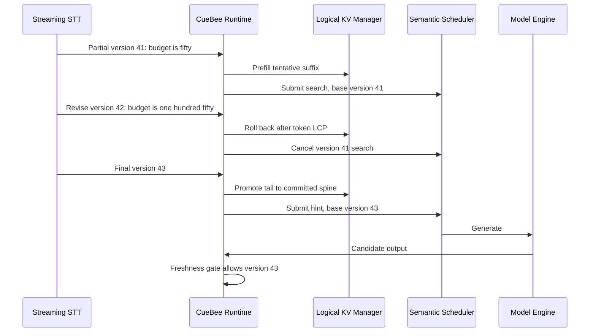

# Architecture and state transitions

## Data plane

The audio path filters silence before inference, groups chunks by duration, and dispatches a batch when size, wait, or earliest deadline requires it. Batches may contain chunks from different Sessions. Stateless workers emit embeddings; the Session Store owns centroids and stable speaker identifiers, so worker restart or scale-out does not change identity continuity.

The text path accepts complete hypotheses for one Speech-to-Text (STT) segment. A vendor callback becomes one of Append Partial, Revise Partial, Commit Final, Speaker Relabel, or Session Close. Segment revision, client epoch, and sequence number make replay deterministic and idempotent.

## Conversation state

Each Session has two token regions:

- Committed spine: Final text that only grows.
- Tentative tail: the latest Partial hypothesis, which may be prefetched and rolled back.

On revision, the runtime retokenizes the full hypothesis with the model tokenizer, finds the token Longest Common Prefix (LCP), applies a configurable guard window, and invalidates only the divergent suffix. Text-character equality is never used as a cache validity proof.

## Logical Key-Value cache model

`VersionedKVManager` tracks three independent properties on logical references:

| Axis | Values | Meaning |
|---|---|---|
| Validity | Committed, Tentative, Invalidated | Whether the content is stable, revisable, or unusable |
| Ownership | Spine, Shared, Branch Private | Which logical consumer owns the reference |
| Residency | Graphics Processing Unit, Central Processing Unit, Evicted | Where a physical implementation currently places the block |

The local `BlockPool` is a deterministic physical-block model used to prove reference counting and Copy-on-Write (COW) transitions. When a shared partial block must be extended or truncated, the mutating owner receives a copy while other branches retain the old view.

## Branch dependencies

Each analysis task owns a branch with:

- `base_version`;
- a token dependency interval;
- whether it includes Tentative tokens;
- whether it requires the exact current version.

Proactive hints and search decisions require the current tail version. Memory extraction and context summary normally depend only on committed ranges and can survive an unrelated tail revision.

## Scheduling and output

The semantic scheduler rejects stale work before ordinary scoring. Remaining work is ranked by deadline urgency, foreground status, queue age, shared-prefix length, estimated cost, and explicit priority. Overload shedding drops summary, then memory, then search before user queries.

The final gate runs after model generation. This is intentionally redundant with cancellation: an abort may race an in-flight forward pass, so an old output must still be rejected before entering the earphone or long-term memory.

## Revision sequence

